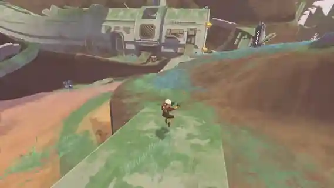
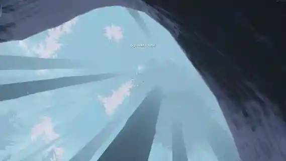
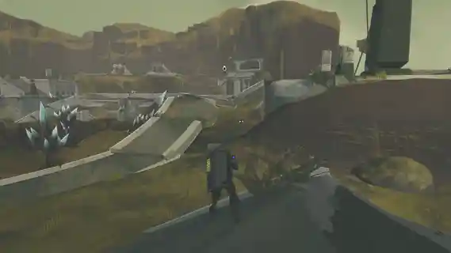

A simple Risk Of Rain 2 mod that adds 3 new artifacts themed around the Void.
All of these are relatively simple but overall fun in their own very weird and often evil ways.
-
### Infestation

- Spawns Void Infestors from nearly every interactable. Different interactables spawn differing amounts of Infestors at different rates. Interactables that spawn items spawn more Infestors based on the items tier.
---

### Invasion

- Void Seeds are significantly more common and more can spawn.
---
### Nullification

- Spawns random Void Implosions from every dead non-Void enemy, including a black hole attack from a boss.
